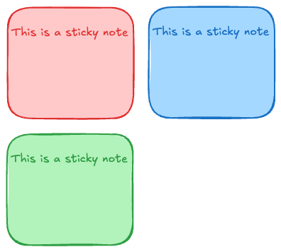

# Sticky Todo List

Build a simple todo list React application that:

## Goals

1. Displays a list of todos appearing as sticky notes
2. Allows adding new stickies
3. Allows removing stickies
4. Allows selecting the color of each sticky note

## Stretch Goals

- Implement local storage to persist stickies
- Implement cloud storage using REST API

## Concept

## Implementation

_Get creative!_

This is a simple prototype to demonstrate your problem-solving skills around:

- Component composition
- React state management
- User Experience (UX)
- Basic CSS styling

